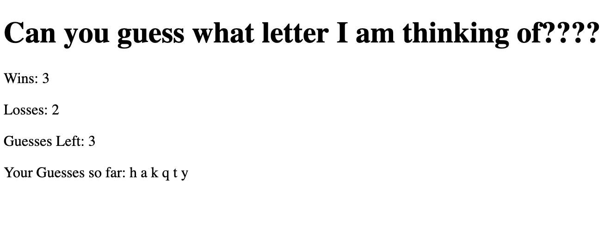

# Psychic-Game
* This app is a guessing game. The computer chooses a letter at random and the user has 9 attempts to guess which letter the computer has chosen. The app logs wins/losses and chooses a new letter for the user to guess after all 9 attempts have been used (loss) or after the user guesses the correct letter (win). 

[Click here to check out the site!](https://gljacobs.github.io/Psychic-Game/)

## Technologies used:
* HTML 
* CSS
* Javascript

## Author: Gabriel Jacobs
